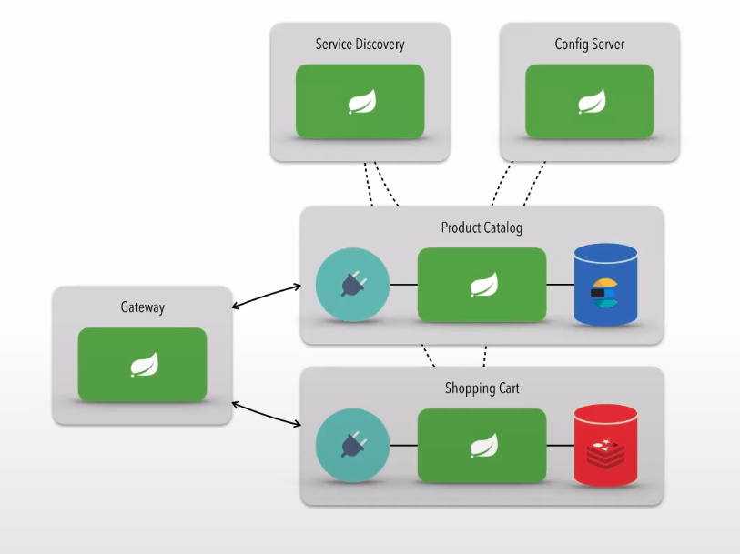

# Microservices using Spring Cloud

## Requirements

[Docker](https://www.docker.com/) 

[Docker Compose](https://docs.docker.com/compose/)

### Architecture



## Technologies
    - Java
    - Spring Boot

##  How to run

  > running Project
  ```bash
   
    # Running the project database service	
	
    In the terminal access the directory and run
    
    #to start
    docker-compose up --build -d 
    
    # to stop and destroy.
    docker-compose down 

    # to check the services
    docker ps 

    after that, run each services normally according to your IDE
```